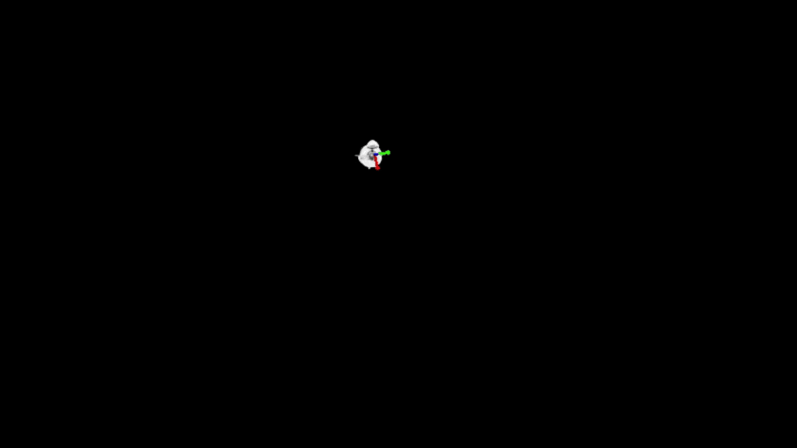

# UrsoNet for Monocular Spacecraft 6D Pose estimation

Tensorflow/Keras implementation of UrsoNet, the network used on the [European Space Agency's Pose Estimation Challenge](https://kelvins.esa.int/satellite-pose-estimation-challenge/) that achieved 3th place.

<p align="center">

</p>

UrsoNet is a simple architecture developed for object pose estimation, which uses Resnet as a backbone.
While one branch simply regresses location, the other performs orientation soft classification. Other options, e.g., quaternion regression, are also provided by this implementation.

<p align="center">

</p>

For mere details check our [Arxiv preprint](https://arxiv.org/abs/1907.04298).

```
@article{proenca2019deep,
  title={Deep Learning for Spacecraft Pose Estimation from Photorealistic Rendering},
  author={Proenca, Pedro F and Gao, Yang},
  journal={arXiv preprint arXiv:1907.04298},
  year={2019}
}
```

## Getting started

#### Data
First, you will need data. This framework is ready to use either our
[URSO datasets](https://zenodo.org/record/3279632#.XZIIuHVKg5k)
or the [SPEED dataset](https://kelvins.esa.int/satellite-pose-estimation-challenge/data/) 
released by Stanford SLAB and ESA.

Just download a dataset and copy it to the directory `datasets`.

Then you will need the dataset split into train/val/test subsets.
This was already done for *URSO datasets* by retaining 10% for the test set and other 10% for the validation set - notice the CSV files. 
However you can easily regenerate these random splits by using the script `split_dataset.py`.
Say you want instead 15% each for the *soyuz_hard*, then run:
```
python3 split_dataset.py --dataset_dir datasets/soyuz_hard --test_percentage 15 --val_percentage 15
```

If you are using *SPEED* then in a Python console, type:
```python
import utils
split_speed('datasets/speed', 10)
```
This will split 90% of the dataset for training and 10% for the validation set by generating the respective JSON files. N.b.
At the time of writing, SPEED test set is not open.

#### Dependencies

Python>=3.4, TensorFlow=>1.9, Keras>=2.1.6 and other common packages listed in `requirements.txt`.
You can use the following to install all dependencies.
```
pip3 install -r requirements.txt
```

## Usage and Configuration

While the actual network implementation is in `net.py`.
The main script to train and test UrsoNet is the `pose_estimator.py` which
takes the following general arguments:

| Argument| Required | Type | Description |
|-------------------|--------------|---------- | ------|
| backbone  | False | string| Backbones currently supported {'resnet18', 'resnet34', 'resnet50', 'resnet101'}. Default='resnet50'|
| dataset   | True  | string| Name of dataset folder. If you are using SPEED set this to 'speed' |
| weights | True | string | A path to weights .h5 file or 'coco' for coco pre-trained weights or 'last' for last trained model|
| image_scale | False | float | Scale used to resize input image, default=1.0 |
| square_image | False | bool | Pads input images with zeros to get a square. By default, images are only resized and padded enough to get dimensions multiples of 64 |
| bottleneck | False | int |  Bottleneck width, default=32  |
| branch_size | False | int | Size of branch input layers, default=1024  |
| f16 | False | bool | If you are using modern GPUs (RTX), this tells TF/Keras to use half precison: float16. By default this is False.|
| regress_ori | False | bool | Sets orientation branch to regression. By default this branch does classification|
|ori_resolution|False| int |Number of bins assigned to each Euler angle, default=16|
| ori_param  | False | string| Regression orientation parameterization: {'quaternion', 'euler_angles', 'angle_axis'}, default='quaternion'|
| classify_loc  | False | bool| Sets location branch to classifcation. By default this branch does regression|
| regress_keypoints  | False | bool| Experimental. Overrides the branch configuration above and sets this to regression of 3 3D keypoints. By default this is false.|

#### Training
 
The training configuration takes also the following arguments:

| Argument| Required | Type | Description |
|-------------------|--------------|---------- | ------|
| batch_size  | False | int | Number of images used per GPU, default=4  |
| epochs | False | int | Number of epochs, default=100              |
| clr| False   | bool| Option to use cyclical learning rate, default=False, You need to adjust other clr params in `config.py`|
| learn_rate  | False  |float | Fixed learning rate, in theory this should depend on the batch size, default: 0.001 |
| rot_aug  | False     |  bool | Option to use camera orientation perturbations as augmentation, default=False |
|rot_image_aug| False |  bool | Option to use in-plane image rotation as augmentation, default=False |
| sim2real  | False |  bool     | Enables the image augmentation pipeline proposed in the paper. This includes converting to grayscale. You can change this in `net.py`, default=False|
| ori_weight  | False|  float | Orientation loss weight, default = 1.0               |
| loc_weight  | False|  float | Location loss weight, default = 1.0                  |


To train UrsoNet on 'soyuz_easy' with ResNet-50, pre-trained backbone
weights from COCO and rotation augmentation use:
```
python3 pose_estimator.py train --dataset soyuz_easy --weights coco --image_scale 0.5 --ori_resolution 24 --rot_aug --rot_image_aug
```

This will generate a new checkpoint directory inside `logs`, where weights will
be stored and accumulated along with the configuration parameters. To suppress annoying warnings just add ```-W ignore``` to the command above before the script name.

You can stop and resume training whenever you want. To continue training the last trained model from the last checkpoint, with a lower `learning_rate` simply run:
```
python3 pose_estimator.py train --dataset soyuz_easy --weights last --image_scale 0.5 --ori_resolution 24 --rot_aug --rot_image_aug --learning_rate 0.0001
```
Just make sure you are using consistent network configurations. 

#### Inference

To test and visualize results on the test-set using the weights of a specific model inside `logs`, e.g., 'soyuz_20191001T1207' (feel free to rename it), run
```
python3 pose_estimator.py test --dataset soyuz_easy --weights soyuz_easy20191001T1207 --image_scale 0.5 --ori_resolution 24
```
This will show several windows per image, which you will need to close to load the next image.

To evaluate the network on the full test set (val set for 'SPEED'). Use:
```
python3 pose_estimator.py evaluate --dataset soyuz_easy --weights soyuz_easy20191001T1207 --image_scale 0.5 --ori_resolution 24
```

#### Pre-trained weights on URSO and SPEED

Our weights are available [here](https://github.com/pedropro/UrsoNet/releases/tag/v1.0).
If you want to use directly our weights, all you have to do is change the argument
 `weights` to one of these `{'soyuz_hard', 'dragon_hard', 'speed'}` and make sure you pass the right arguments like this:
```
python3 -W ignore  pose_estimator.py test --dataset soyuz_easy --weights soyuz_hard --image_scale 0.5 --ori_resolution 24 --bottleneck 128 --square_image
```
or this:
```
python3 -W ignore  pose_estimator.py test --backbone resnet101 --dataset speed --weights speed --image_scale 0.5 --ori_resolution 32 --bottleneck 528 --f16
```


